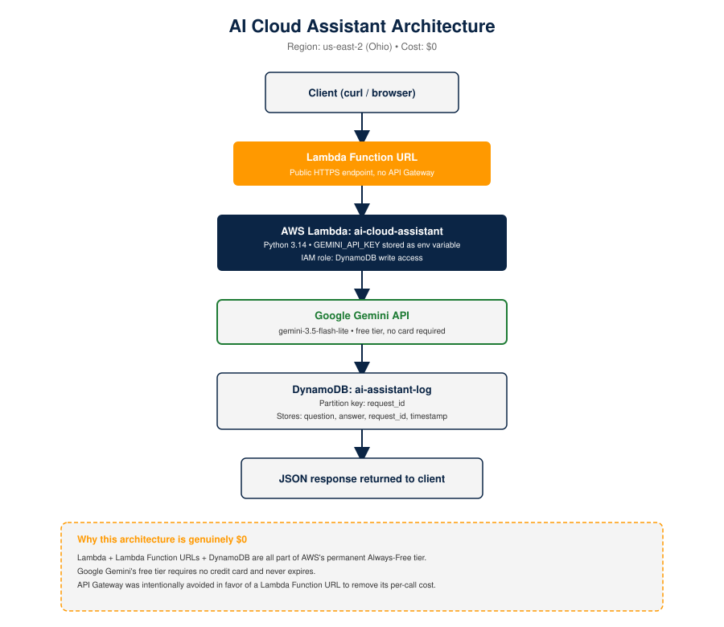
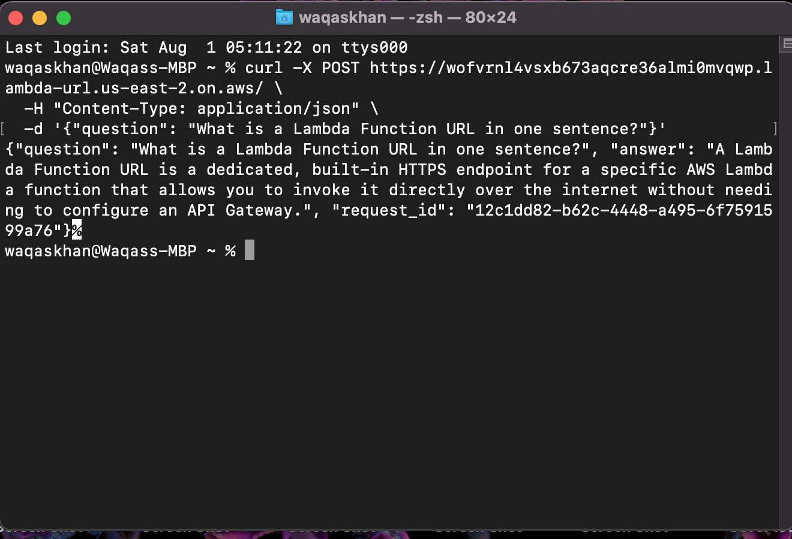

# AI Cloud Assistant — Serverless AI on AWS



A serverless AI-powered API built entirely on AWS's Always-Free tier, integrated with Google's free-tier Gemini AI model. Demonstrates cloud infrastructure built specifically to power AI applications, at genuinely $0 cost.

## Live Endpoint

https://wofvrnl4vsxb673aqcre36almi0mvqwp.lambda-url.us-east-2.on.aws/

**Example request:**
```bash
curl -X POST https://wofvrnl4vsxb673aqcre36almi0mvqwp.lambda-url.us-east-2.on.aws/ \
  -H "Content-Type: application/json" \
  -d '{"question": "What is AWS Lambda in one sentence?"}'
```



## Architecture

Client → Lambda Function URL → AWS Lambda (Python) → Google Gemini API → DynamoDB → JSON response

A Lambda Function URL was used intentionally instead of API Gateway to keep the entire architecture within AWS's Always-Free tier. Google's Gemini API was used instead of Amazon Bedrock specifically to avoid per-token billing — Bedrock has no free tier, while Gemini's free tier is permanent and requires no credit card.

## Services Used

| Service | Purpose |
|---|---|
| AWS Lambda | Runs the Python function handling each request; Always Free tier |
| Lambda Function URL | Public HTTPS endpoint directly on the function, no API Gateway needed |
| Environment Variables | Securely stores the Gemini API key, encrypted at rest, never hardcoded |
| IAM Execution Role | Grants the function permission to write to DynamoDB |
| Amazon DynamoDB | Stores each question/answer interaction as a log entry; Always Free tier |
| Google Gemini API | External AI model providing the actual responses, permanent free tier |

## The Five-Bug Debugging Story

Building this surfaced five separate, real issues — each diagnosed from the actual error message, not guesswork:

1. **HTTP 429 (Too Many Requests)** — Hit Gemini's free-tier rate limit on the first test. Confirmed the pipeline was already working correctly; just needed to wait and retry.
2. **HTTP 404 — Deprecated model (`gemini-2.0-flash`)** — The originally hardcoded model had been officially retired. Fixed by researching current model availability and switching to `gemini-2.5-flash`.
3. **HTTP 404 again — A second deprecated model (`gemini-2.5-flash`)** — That replacement had *also* been restricted for new API keys. Diagnosed by improving the error handling to surface Google's full detailed error message instead of a generic one — which directly revealed the real cause. Fixed by switching to the current GA model, `gemini-3.5-flash-lite`.
4. **Lambda timeout after 3 seconds** — The AI call was succeeding but exceeding Lambda's default timeout. Fixed by increasing the configured timeout to 30 seconds.
5. **DynamoDB `ResourceNotFoundException`** — The final failure was a table name mismatch: code referenced `ai-assistant-logs` (plural), the real table was `ai-assistant-log` (singular). Fixed by correcting the name.

## What I Learned

- How to build a fully serverless architecture using only AWS's Always-Free services
- Why a Lambda Function URL can replace API Gateway for simple use cases, avoiding extra cost
- How to securely store API keys using Lambda environment variables instead of hardcoding secrets
- How improving error handling to surface upstream API responses can be the key to fast, accurate debugging
- How to integrate a third-party AI API into a serverless AWS workflow

## Next Steps

- Add authentication to the Function URL (currently open, appropriate for a demo but not production)
- Scope the IAM policy down from full DynamoDB access to only the specific table and actions needed
- Add a simple frontend to make the assistant usable without curl
